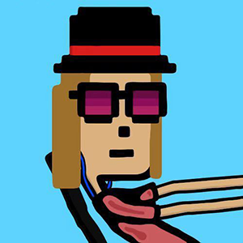

# 卷首语

一个中国小孩，要摆脱父母精神上的束缚，摆脱教育体系的束缚，摆脱传统糟粕的束缚，获得自由之思想，独立之精神，是非常难的。在我成长的过程中，对世界的看法，对自己的认知就如同蝉蜕皮一样，每蜕下一层，都觉得开阔一点。写作就好像是一种救赎，可以让自己不再处于麻木、服从、竞争的状态，可以真正成为自己，而不是跟随他人，迎合他人，超过他人。

借助这个个人博客，我希望可以记录生活的点滴，回溯生命的轨迹，守护初心。

